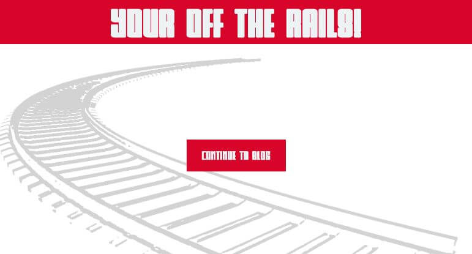

# Off the rails

**About**

Off the rails a web app built in the Ruby on Rails frame-work, users can create, update, delete, and comment on articles. This project is an adaptation of the official [Getting Started with Rails Guide.](https://guides.rubyonrails.org/getting_started.html) 

The tech stack for this project is Ruby, Ruby On Rails RSpec and PostgreSQL apposed to SQLight. In addition to this the app formats posts and has CSS styling. 

## What you can do

As a user you can post, update and delete articles, articles persist when running the app on a local database. Other users can also leave comments on your posts, they can also later delete their comments if they wish to do so.

**How to run**

1. In order to run the application first clone the repo.

`git clone git@github.com:Steven-Klavins/off-the-rails.git`

2. Next navigate to the off-the-rails directory and run bundle install to add the dependencies.

`bundle install`

3. Setup the PostgreSQL database locally with the following command:

`db:setup`

3. Start the server with following command:

`rails s` 

4. Well done your off the rails!

visit `http://localhost:3000/`

**Use**

**The landing page (http://localhost:3000/)**

There's not really a lot to say about this page other than click "Continue to blog"

**The articles page (http://localhost:3000/articles)**

When you first run the app the only option available on this page will be to add a new article, once adding one or more you articles we have a list of additional options displayed underneath.

**Show**

**Edit**

**Delete**

**Future updates**

At present, there are a few things about this project I would like to add, probably the biggest being user authentication. If I deployed the site at this moment in time there would be no way of preventing users from editing articles under a false alias. However, to tell the truth, deployment was never really something I was planning on, the purpose of building this site was to help me learn Rails and in that, I did achieve my primary goal.  
